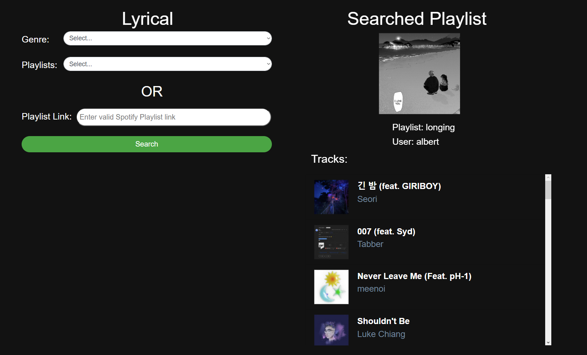

# Lyrical
*Find your music taste*

> ⚠️ **Currently on Pause. Incorporating within [MusAe](https://github.com/Tofulati/MusAe)** ⚠️

## Description
On going project aimed at utilizing the Spotify API to find similar songs that follow the user's tastes. Once the project exits the development stage, it would be available to run utilizing local servers. 

The project may change throughout the development stage as I am still exploring the APIs

## Ideas
- User can enter song link that will search for similar songs
- User can create a playlist from searched songs
- User can find most listened song to find more similar songs

## Current Capabilities
- Functioning JS, HTML, and CSS webpage
- User can select specified genre and playlist (from genre)
- User can enter a Spotify Playlist into search
- Playlists display name, user, and tracks
- Webpage is only currently configured to 1980 x 1080p (will work on display later)
- User can click on songs, linked to Spotify page (only clickable on bottom of column, fixing later)

## Sample

## Goals (Subject to change)
- [ ] User is shown statistics about their most listened to song
- [ ] User is able to select a song (most listened or search)
    - [ ] Can chose from Genre and/or Language
    - [ ] Once selected, the user is prompted to highlight a line from their song
    - [ ] The line would be processed and search the APIs for similarities
    - [ ] Retrieve data and show User variety of songs
- [ ] User is able to listen to song or rerun program
    - [ ] Can create a playlist
        - Selectable?
        - Predetermined?

## Help
If there is an issue contact me at: aho66@ucmerced.edu
